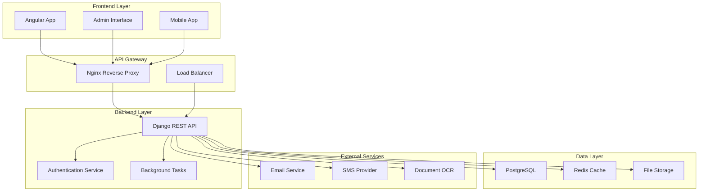
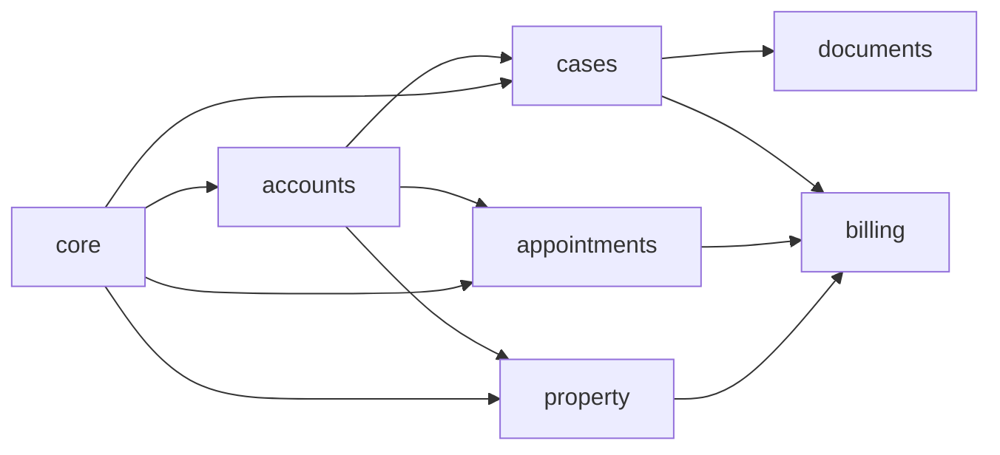
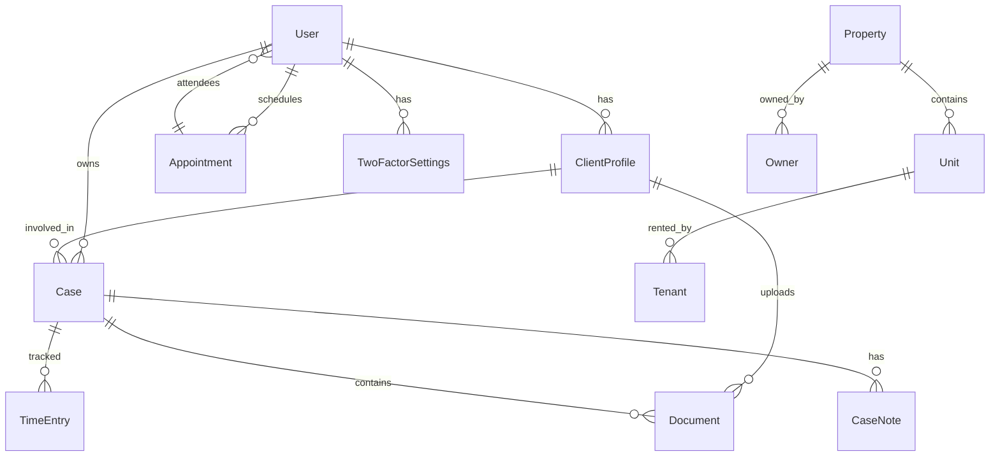
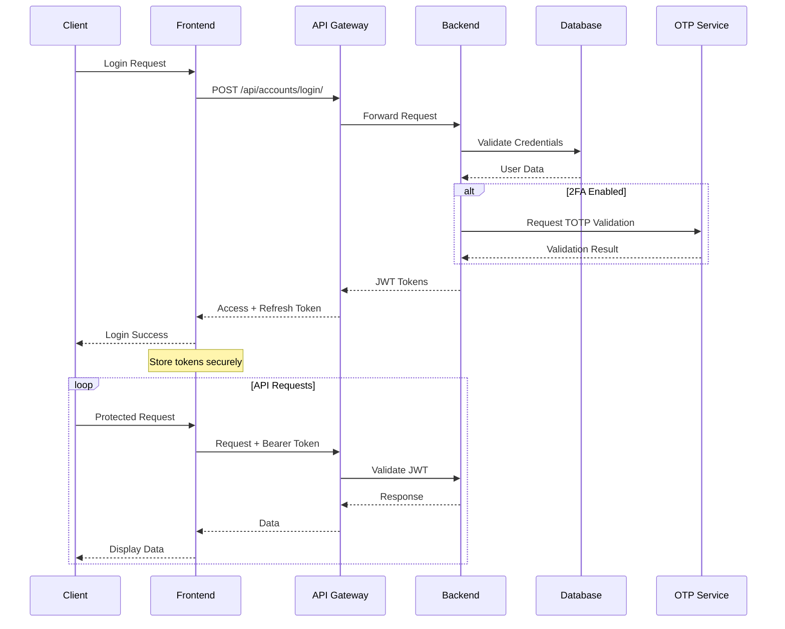
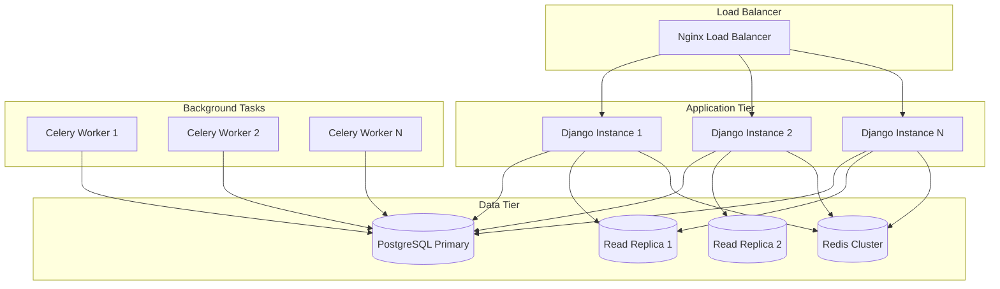

# 🏗️ System Architecture

Dokumentation der **Jura Modular** System-Architektur und technischen Konzepte.

## 📐 System Overview

**Jura Modular** ist als modulare, skalierbare Web-Anwendung konzipiert mit klarer Trennung zwischen Backend, Frontend und externen Services.



## 🛠️ Technology Stack

### Backend Stack
| Component | Technology | Version | Purpose |
|-----------|------------|---------|----------|
| **Web Framework** | Django | 5.2+ | Core application framework |
| **API Framework** | Django REST Framework | 3.14+ | RESTful API development |
| **Authentication** | SimpleJWT + django-otp | Latest | JWT tokens + 2FA |
| **Database ORM** | Django ORM | Built-in | Database abstraction |
| **Task Queue** | Celery | 5.3+ | Background job processing |
| **Caching** | Redis | 7.0+ | Session & data caching |
| **Search Engine** | Elasticsearch | 8.0+ | Full-text search (planned) |

### Frontend Stack
| Component | Technology | Version | Purpose |
|-----------|------------|---------|----------|
| **Framework** | Angular | 17+ | SPA frontend framework |
| **UI Components** | Angular Material | 17+ | Material Design components |
| **State Management** | NgRx | 17+ | Application state management |
| **HTTP Client** | Angular HttpClient | Built-in | API communication |
| **Forms** | Angular Reactive Forms | Built-in | Form handling & validation |
| **Charts** | Chart.js / D3.js | Latest | Data visualization |

### Infrastructure Stack
| Component | Technology | Version | Purpose |
|-----------|------------|---------|----------|
| **Web Server** | Nginx | 1.20+ | Reverse proxy & static files |
| **Application Server** | Gunicorn | 21+ | WSGI HTTP server |
| **Database** | PostgreSQL | 15+ | Primary data storage |
| **Message Broker** | Redis | 7.0+ | Task queue & caching |
| **Containerization** | Docker | 24+ | Application packaging |
| **Orchestration** | Docker Compose | 2.0+ | Multi-container management |

## 🏢 Application Architecture

### Django Apps Structure

```
kanzlei_backend/
├── kanzlei_apps/
│   ├── accounts/           # Benutzer & Authentifizierung
│   ├── cases/             # Mandats-/Fallverwaltung  
│   ├── appointments/      # Terminplanung
│   ├── documents/         # Dokumentenmanagement
│   ├── billing/          # Abrechnung & Zeiterfassung
│   ├── property/         # Hausverwaltung
│   ├── notifications/    # Benachrichtigungen
│   └── core/            # Shared utilities
├── kanzlei_backend/      # Django project settings
├── static/              # Static files
├── media/              # User uploads
└── tests/              # Test suites
```

### App Dependencies



## 🗄️ Database Design

### Entity Relationship Overview



### Core Tables

#### Users & Authentication
```sql
-- users_user (Extended Django User)
- id (Primary Key)
- username (Unique)
- email (Unique)  
- first_name
- last_name
- phone_number
- role (admin|lawyer|assistant|client|property_manager)
- two_factor_enabled (Boolean)
- is_verified (Boolean)
- created_at
- updated_at

-- accounts_clientprofile
- id (Primary Key)
- user_id (Foreign Key → User)
- user_type (private|company)
- phone_number
- address
- birth_date
- company_name
- tax_id
- case_notes
- preferred_contact_method
- document_upload_permission
- is_active_client
- created_at
- updated_at

-- accounts_twofactorsettings  
- id (Primary Key)
- user_id (Foreign Key → User)
- backup_tokens (JSON)
- recovery_email
- is_backup_used
- last_used
- created_at
- updated_at
```

#### Cases & Legal Management
```sql
-- cases_case
- id (Primary Key)
- client_id (Foreign Key → ClientProfile)
- lawyer_id (Foreign Key → User)
- case_number (Unique)
- title
- description
- case_type
- status (draft|active|closed|archived)
- priority (low|medium|high|urgent)
- start_date
- deadline
- estimated_hours
- hourly_rate
- created_at
- updated_at

-- cases_casenote
- id (Primary Key) 
- case_id (Foreign Key → Case)
- author_id (Foreign Key → User)
- note_type (general|meeting|phone|email)
- title
- content
- is_billable
- time_spent
- created_at
- updated_at

-- cases_timeentry
- id (Primary Key)
- case_id (Foreign Key → Case)
- user_id (Foreign Key → User)
- description
- hours
- hourly_rate
- is_billable
- entry_date
- created_at
- updated_at
```

### Database Indexes

```sql
-- Performance-kritische Indexes
CREATE INDEX idx_user_role ON users_user(role);
CREATE INDEX idx_user_email ON users_user(email);
CREATE INDEX idx_clientprofile_user ON accounts_clientprofile(user_id);
CREATE INDEX idx_case_client ON cases_case(client_id);
CREATE INDEX idx_case_lawyer ON cases_case(lawyer_id);
CREATE INDEX idx_case_status ON cases_case(status);
CREATE INDEX idx_case_number ON cases_case(case_number);
CREATE INDEX idx_appointment_date ON appointments_appointment(start_time);
```

## 🔒 Security Architecture

### Authentication Flow



### Permission System

```python
# Hierarchical Role System
ROLE_HIERARCHY = {
    'admin': 100,      # Full system access
    'lawyer': 80,      # Case management + clients
    'assistant': 60,   # Limited case access
    'property_manager': 50,  # Property-specific access
    'client': 20       # Own data only
}

# Permission Classes
class IsOwnerOrAdmin(BasePermission):
    def has_object_permission(self, request, view, obj):
        return (
            request.user.is_superuser or
            request.user.role == 'admin' or
            obj.user == request.user
        )

class IsLawyerOrAdmin(BasePermission):
    def has_permission(self, request, view):
        return request.user.role in ['admin', 'lawyer']
```

### Data Protection

| Layer | Protection Method | Implementation |
|-------|------------------|----------------|
| **Transport** | HTTPS/TLS 1.3 | Nginx SSL termination |
| **Authentication** | JWT + 2FA | django-otp + SimpleJWT |
| **Authorization** | RBAC | Custom permission classes |
| **Input Validation** | Django Forms | Serializer validation |
| **SQL Injection** | ORM | Django QuerySet API |
| **XSS Protection** | Template escaping | Django templates |
| **CSRF Protection** | Token validation | Django middleware |
| **Rate Limiting** | Throttling | DRF throttle classes |

## 🚀 Scalability Design

### Horizontal Scaling



### Performance Optimizations

#### Database Layer
```python
# Query Optimization
queryset = ClientProfile.objects.select_related('user')\
    .prefetch_related('cases__documents')\
    .filter(is_active_client=True)

# Database Connection Pooling
DATABASES = {
    'default': {
        'ENGINE': 'django.db.backends.postgresql',
        'OPTIONS': {
            'MAX_CONNS': 20,
            'OPTIONS': {
                'MAX_CONNS': 20,
            }
        }
    }
}
```

#### Caching Strategy
```python
# Multi-level Caching
CACHES = {
    'default': {
        'BACKEND': 'django_redis.cache.RedisCache',
        'LOCATION': 'redis://redis:6379/1',
        'OPTIONS': {
            'CLIENT_CLASS': 'django_redis.client.DefaultClient',
        }
    },
    'sessions': {
        'BACKEND': 'django_redis.cache.RedisCache', 
        'LOCATION': 'redis://redis:6379/2',
    }
}

# View-level caching
@cache_page(60 * 15)  # 15 minutes
def client_list_view(request):
    pass

# Object-level caching
@cached_property
def expensive_calculation(self):
    return complex_calculation()
```

## 🔄 Background Tasks

### Celery Task Architecture

```python
# Task Categories
CELERY_TASK_ROUTES = {
    'kanzlei_apps.notifications.tasks.send_email': {'queue': 'email'},
    'kanzlei_apps.documents.tasks.process_upload': {'queue': 'documents'},
    'kanzlei_apps.billing.tasks.generate_invoice': {'queue': 'billing'},
    'kanzlei_apps.core.tasks.cleanup_temp_files': {'queue': 'maintenance'},
}

# Example Tasks
@shared_task(bind=True, max_retries=3)
def send_notification_email(self, user_id, template, context):
    try:
        user = User.objects.get(id=user_id)
        send_templated_mail(template, context, [user.email])
    except Exception as exc:
        self.retry(countdown=60, exc=exc)

@shared_task
def process_document_upload(document_id):
    document = Document.objects.get(id=document_id)
    # OCR processing, thumbnail generation, etc.
    return f"Processed document {document_id}"
```

## 📊 Monitoring & Observability

### Health Checks

```python
# Health Check Endpoints
class HealthCheckView(APIView):
    def get(self, request):
        checks = {
            'database': self.check_database(),
            'redis': self.check_redis(),
            'celery': self.check_celery(),
            'disk_space': self.check_disk_space(),
        }
        
        status = 'healthy' if all(checks.values()) else 'unhealthy'
        return Response({'status': status, 'checks': checks})
```

### Logging Strategy

```python
LOGGING = {
    'version': 1,
    'disable_existing_loggers': False,
    'formatters': {
        'verbose': {
            'format': '{levelname} {asctime} {module} {process:d} {thread:d} {message}',
            'style': '{',
        },
    },
    'handlers': {
        'file': {
            'level': 'INFO',
            'class': 'logging.handlers.RotatingFileHandler',
            'filename': 'logs/django.log',
            'maxBytes': 1024*1024*15,  # 15MB
            'backupCount': 10,
            'formatter': 'verbose',
        },
        'security': {
            'level': 'WARNING',
            'class': 'logging.handlers.RotatingFileHandler',
            'filename': 'logs/security.log',
            'formatter': 'verbose',
        },
    },
    'loggers': {
        'django': {'handlers': ['file'], 'level': 'INFO'},
        'django.security': {'handlers': ['security'], 'level': 'WARNING'},
        'kanzlei_apps': {'handlers': ['file'], 'level': 'DEBUG'},
    },
}
```

## 🧪 Testing Architecture

### Test Structure

```
tests/
├── unit/              # Unit tests for models, utils
├── integration/       # API endpoint tests
├── functional/        # End-to-end workflows
├── performance/       # Load testing
├── security/          # Security testing
├── fixtures/          # Test data
└── factories/         # Data factories
```

### Test Categories

```python
# Unit Tests - Fast, isolated
class UserModelTest(TestCase):
    def test_user_creation(self):
        user = User.objects.create_user(username='test')
        self.assertEqual(user.role, 'client')

# Integration Tests - API endpoints
class AccountsAPITest(APITestCase):
    def test_login_endpoint(self):
        response = self.client.post('/api/accounts/login/', data)
        self.assertEqual(response.status_code, 200)

# Functional Tests - Full workflows
class CaseManagementWorkflowTest(TransactionTestCase):
    def test_complete_case_lifecycle(self):
        # Create client → Create case → Add documents → Generate bill
        pass
```

---

Diese Architektur-Dokumentation bildet die Grundlage für die weitere Entwicklung und Skalierung des **Jura Modular** Systems. 🏗️
